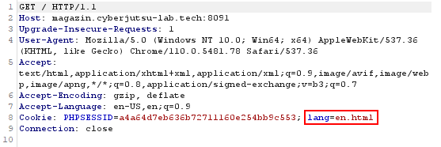
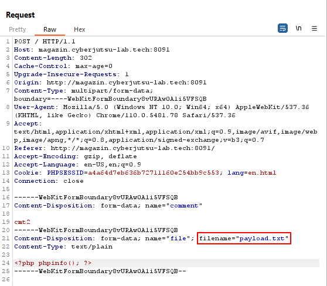

# Target: http://magazin.cyberjutsu-lab.tech:8091/

## Overview
`Infosecurity Magazine: một trong những tạp chí an toàn thông tin hàng đầu của Việt Nam. Người dùng có thể tự do bày tỏ quan điểm của mình.`

### Pentester: team2

### Tools: Burp Suite, VS Code, Chrome

## MAG-01-001: File Upload + Path Traversal dẫn đến RCE (Nghiêm trọng)
<!--
- Lỗ hổng gì, xảy ra ở đâu
- Mức độ ảnh hưởng tổng quan (overall impact)

Tiêu chí: 1 dòng, không quá 30 chữ
-->

### Description and Impact
- Chức năng chuyển đổi ngôn ngữ từ Tiếng Anh sang Tiếng Việt và ngược lại
- File ngôn ngữ (en.html) được truyền thẳng vào cookie

- Chức năng comment cho phép user upload file (txt, png, jpg)
- User có thể upload file chứa code PHP và thay đổi cookie để chạy code PHP để RCE server
<!--
- Giới thiệu sơ bộ về API, features của sản phẩm, và chỉ ra thành phần nào đang bị lỗi
- Vị trí đang bị lỗi? (API, endpoint, webpage nào)
- Lỗi đang khai thác là gì? Trình bày kịch bản tấn công và mức độ ảnh hưởng của nó gây ra

Tiêu chí:
- Không quá 5 dòng, không nhiều hơn 200 từ
- Khiến một technical manager đọc hiểu được
Thông tin thêm: Affected version/platform, Affected user,…
-->

<!-- ### Root Cause Analysis [nếu có thể] -->
<!--
(khi có mã nguồn hoặc một phần mã nguồn)

- Trích dẫn mã nguồn liên quan (file nào, dòng số mấy, hàm nào)
- Giải thích ngữ cảnh, nguyên nhân sâu xa của lỗ hổng (Hàm nào, đoạn code nào đã gây ra nó?)
- Mô tả cách mà payload tấn công sẽ tác động vào các phần code và dẫn đến viễn cảnh tấn công

Tiêu chí:
- Chính xác, logic, đầy đủ thông tin
- Dễ đọc, dễ nắm bắt mạch suy nghĩ của người viết
- Highlight các phần quan trọng, hình ảnh minh họa (nếu có)
-->

### Steps to reproduce
<!--
(Proof-of-concept, viết tắt PoC)

Từng bước để tái hiện lại lỗ hổng bảo mật. Hãy thử đóng vai người khác, và làm theo đúng chỉ dẫn của bạn đưa ra trước khi submit.

Tiêu chí:
- PoC ổn định, dễ dàng reproduce
- PoC tinh gọn, ít bước thực hiện nhất có thể
- PoC có hình ảnh, video mô tả trực quan
-->
1. Comment và upload file payload.txt chứa code PHP
  
2. File payload.txt được lưu ở path sau: http://magazin.cyberjutsu-lab.tech:8091/upload/90dc6e942539c671dd5e3e965d19c1be/payload.txt 
3. Thay đổi cookie thành path của file payload.txt để thực thi code PHP 
 
4. Đổi file payload.txt thành payload.png hoặc payload.jpg thì kết quả tương tự nhau, code PHP vẫn được thực thi
5. Thay đổi code PHP để chạy hàm system ta có thể RCE server và đọc flag

<!-- ### Attachments -->
<!--
Cung cấp thêm các mã khai thác, hình ảnh, video, crash log, stacktrace,…
-->

### Recommendations
- Thay đổi quyền chạy code PHP, chỉ thực thi code PHP ở những nơi cần thiết
- File do người dùng upload lên nên được để ở một nơi riêng biệt so với website chính
- Sử dụng thư viện có sẵn để validate file thay vì tự code chức năng validate file
<!--
(dev sẽ rất yêu bạn vì phần này ❤️)

Những lời khuyên về cách vá lỗi. Một người security engineer giỏi sẽ nghĩ ra rất nhiều phương án phòng thủ (mitigations) hiệu quả!
-->

### References
- [1] CyberJutsu Academy: https://cyberjutsu.io/
- [2] PortSwigger Academy https://portswigger.net/web-security/dashboard
<!--
Các đường link tham khảo, cung cấp thông tin thêm, giúp vendor hiểu rõ hơn về loại bug này, cũng như các cách phòng chống
-->

<!-- Nếu nội dung phía trên có đánh dấu trích dẫn thì cần thêm số tham chiếu, ví dụ: -->
<!-- [1] http://example1.com
- http://example2.com
- http://example3.com -->